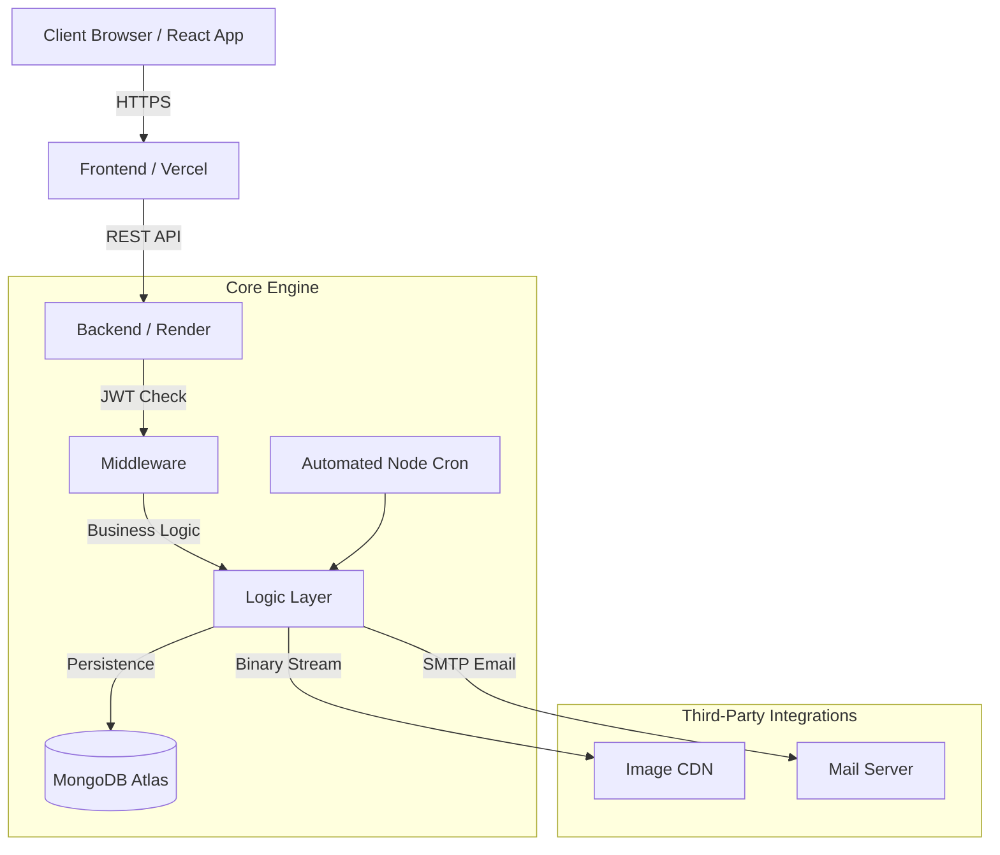

<div align="center">

# Full-Stack Role-Based Meal Delivery Platform (MERN)

[](https://react.dev/)
[](https://nodejs.org/)
[](https://expressjs.com/)
[](https://www.mongodb.com/)
[](https://tailwindcss.com/)
[](https://vitejs.dev/)

A modern, responsive, and secure meal delivery (Dabba Service) platform built with the MERN Stack. Designed with a robust Role-Based Access Control (RBAC) architecture, automated billing, and wallet management to deliver distinct experiences for Customers and Kitchen Administrators.

</div>

---

## 1. Project Vision & Core Features

This platform is engineered to handle complex recurring subscriptions, daily cutoffs, financial ledgers, and automated logistics processing.

### Security & Financial Persistence
- **Stateless Authentication:** Implements JWT-based auth where tokens are stored in HTTP-Only cookies, mitigating XSS and session hijacking.
- **Prepaid Wallet Ledger:** Tracks all CREDIT and DEBIT transactions securely through MongoDB.
- **Automated Billing Engine:** Server-side Cron jobs evaluate subscription statuses, skip dates, and wallet balances to autonomously deduct daily meal costs (₹100) exactly at cutoff time.

### Logistics & User Engagement
- **Dynamic Delivery States:** Dashboard calculates delivery states (Pending, Skipped, Delivered, Missed Cutoff) in real-time strictly adhering to Indian Standard Time (IST).
- **Skip Meal Architecture:** Interactive calendar interface allowing users to pause subscriptions for specific future dates with strict 11:00 AM IST cutoffs.
- **Transactional Notifications:** Automated SMTP NodeMailer integration alerts users the moment their meal is marked delivered.
- **Cloud Media Hosting:** Integrated Cloudinary pipeline for dynamic daily menu image management and user profiles.

---

## 2. Roles & Permissions (RBAC)

The application features a Two-Tier role system that dictates the UI layout, API access, and financial capabilities.

| Role | Permissions & Capability Scope |
| :--- | :--- |
| **USER (Customer)** | Can register, login, deposit funds into their wallet, manage delivery addresses, toggle daily subscription states, schedule skipped meals via the calendar, and track today's live delivery status. |
| **ADMIN (Kitchen Manager)** | Full system oversight. Can monitor daily operations metrics (Revenue Growth, Meal Popularity ratios), author the daily menu (food items and images), monitor all user wallet balances, and manually trigger emergency billing runs. |

---

## 3. System Architecture & Data Model

### High-Level Request Flow


---

## 4. How to Use (Installation & Setup)

Follow these steps to instantiate the repository on any computer.

### Prerequisites
- Node.js (v18+)
- MongoDB Atlas Account
- Cloudinary Account
- SMTP Email Credentials (e.g., Gmail App Passwords)

### 1. Initial Setup
```bash
git clone https://github.com/Akhila-1703/mealora-app.git
cd mealora-app
```

### 2. Configure Backend
```bash
cd backend
npm install
```
Create a `.env` file in the `backend` folder:
```env
PORT=4000
DB_URL=your_mongodb_uri
JWT_SECRET_KEY=your_secret
CLOUDINARY_CLOUD_NAME=your_name
CLOUDINARY_API_KEY=your_key
CLOUDINARY_API_SECRET=your_secret
FRONTEND_URL=http://localhost:5173
SMTP_HOST=your_smtp_host
SMTP_USER=your_email
SMTP_PASS=your_email_password
```

### 3. Configure Frontend
```bash
cd ../frontend
npm install
```
Create a `.env` file in the `frontend` folder:
```env
VITE_API_BASE_URL=http://localhost:4000
```

### 4. Running the Project
Launch two separate terminals:
- **Terminal 1:** `cd backend && npm start`
- **Terminal 2:** `cd frontend && npm run dev`

---

## 5. Technical Documentation Links

For a granular look at the Project Structure, File Lists, and Package Details, please refer to the folder-specific manuals:

- [Backend Internal Docs](./backend/README.md): Details the API logic, automated cron jobs, file tree, and server packages.
- [Frontend Internal Docs](./frontend/README.md): Details the UI tree, Zustand state logic, and client packages.

---
<div align="center">
  <i>Engineered with 20+ YOE standards for security, scalability, and UX.</i>
</div>
