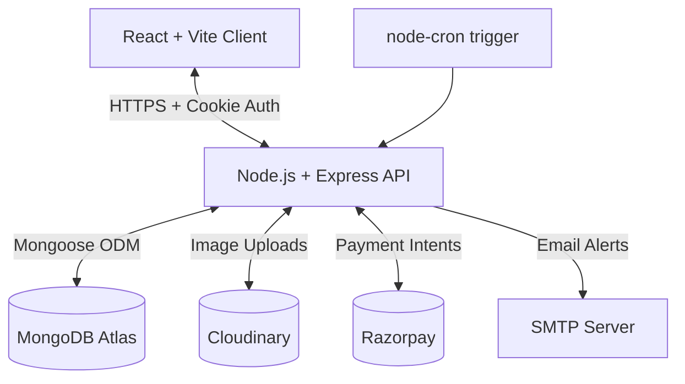

<div align="center">

# MealOra

### *Your Premium Home-Style Meal Delivery Platform*

> A full-stack MERN application delivering fresh, home-cooked meals through a seamless subscription model. Featuring wallet-based payments, dynamic daily menus, and an intelligent 11:00 AM cutoff delivery system.

<br/>

[](https://reactjs.org/)
[](https://nodejs.org/)
[](https://www.mongodb.com/)
[](https://expressjs.com/)
[](https://tailwindcss.com/)
[](https://vitejs.dev/)
[](LICENSE)

</div>

---

## Table of Contents

- [About the Project](#about-the-project)
- [Live Deployments](#live-deployments)
- [System Architecture](#system-architecture)
- [Features](#features)
- [Project Workspaces](#project-workspaces)
- [High-Level Project Structure](#high-level-project-structure)
- [Quick Start](#quick-start)
- [Contributing](#contributing)
- [License](#license)

---

## About the Project

**MealOra** is a sophisticated full-stack food delivery web application built with the MERN stack. It specializes in offering daily home-style meals via an automated subscription and wallet deduction system.

The project covers end-to-end functionality including:

- **Secure Authentication** using stateless HTTP-Only JWT cookies.
- **Wallet System** for seamless, automated daily meal deductions via Razorpay.
- **Delivery Routing** with default and override addresses.
- **Time-Based Logistics** featuring a strict 11:00 AM IST kitchen prep cutoff.
- **Interactive Calendar** allowing users to pause/skip specific delivery days.
- **Automated Billing Runs** using Node-Cron to deduct wallet balances for active deliveries.
- **Admin Command Center** with Recharts analytics and live aggregation pipelines.

---

## Live Deployments

The application is deployed across two robust cloud platforms to ensure maximum uptime and performance:

- **Frontend Application (Vercel):** [https://mealora-app.vercel.app/](https://mealora-app.vercel.app/)
- **Backend API Server (Render):** [https://mealora-app.onrender.com/](https://mealora-app.onrender.com/)

---

## System Architecture

MealOra operates on a highly decoupled client-server architecture. The frontend acts as a pure presentation layer while the backend acts as the secure source of truth.



---

## Features

### Customer-Facing
- **Weekly Menu:** Browse upcoming daily meals curated by the kitchen with Cloudinary images.
- **Meal Wallet:** Pre-load funds via Razorpay to auto-deduct for daily meals.
- **Transactions History:** View a complete ledger of all wallet recharges and daily meal deductions.
- **Subscription Management:** Start, pause, or monitor your meal delivery status.
- **Skip Calendar:** Interactive FullCalendar to skip meals (credits refunded instantly to wallet).
- **Cutoff Engine:** System strictly blocks skipping meals or creating same-day subscriptions after 11:00 AM IST.
- **User Support:** Dedicated support module for user inquiries.
- **User Profile:** Manage personal info, delivery addresses, and avatar uploads.

### Admin-Facing
- **Dashboard KPIs:** Live aggregation of revenue, meals served, active subscriptions.
- **Menu Editor:** Upload, edit, and schedule daily menus with Cloudinary integration.
- **Billing Reports:** Track automated billing runs and total daily deductions.
- **User Management:** Complete directory to manage users, view order histories, and update roles.
- **Low Balance Tracking:** Instantly view users who have insufficient wallet funds for upcoming deliveries.
- **Visualized Data:** Beautiful, interactive charts powered by Recharts.

---

## Project Workspaces

This project is a monorepo divided into two main environments. Click into their respective directories to view deep-dive documentation:

- **[Frontend Client (`/frontend`)](./frontend)**: React UI, Tailwind design system, and Zustand global state.
- **[Backend API (`/backend`)](./backend)**: Express architecture, MongoDB aggregations, and business logic.

---

## High-Level Project Structure

```
MealOra/
├── frontend/                      
│   ├── src/                       
│   │   ├── api/                   # Axios interceptors
│   │   ├── components/            # Reusable UI & Route Guards
│   │   ├── pages/                 # Admin & User views
│   │   ├── store/                 # Zustand global state
│   │   └── App.jsx                
│   └── package.json               
│
├── backend/                       
│   ├── APIs/                      # Route controllers (AuthAPI, WalletAPI, etc.)
│   ├── config/                    # Cloudinary & Multer config
│   ├── middleware/                # JWT verifyToken middleware
│   ├── models/                    # Mongoose Models (UserModel, SubscriptionModel)
│   └── server.js                  
│
└── README.md                      
```

---

## Quick Start

To run the entire platform locally, you will need to install dependencies and start both servers.

### 1. Clone the Repository
```bash
git clone https://github.com/Akhila-1703/mealora-app.git
cd mealora-app
```

### 2. Start the Backend
```bash
cd backend
npm install
npm run dev
```

### 3. Start the Frontend
Open a new terminal:
```bash
cd frontend
npm install
npm run dev
```

---

## Contributing
Contributions of all kinds are welcome! Create a feature branch, commit your changes, and open a Pull Request.

## License
This project is licensed under the **MIT License**.