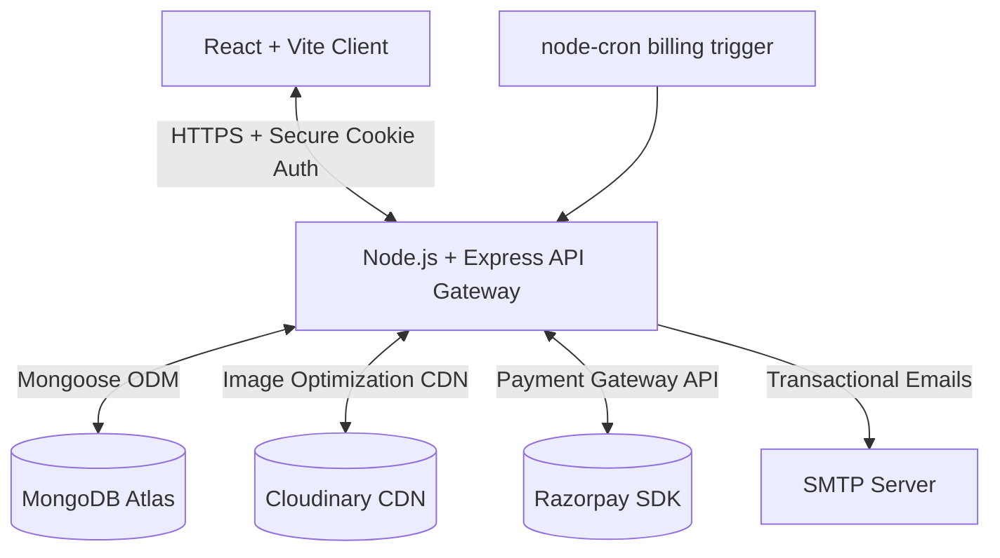

<div align="center">

# MealOra

### *Your Premium Home-Style Meal Delivery Platform*

> A robust, production-grade MERN stack enterprise application delivering fresh, home-cooked meals via a seamless, automated subscription model. Engineered with secure wallet-based transaction systems, dynamic menu allocation, and an intelligent same-day logistics cutoff engine.

<br/>

[](https://reactjs.org/)
[](https://nodejs.org/)
[](https://www.mongodb.com/)
[](https://expressjs.com/)
[](https://tailwindcss.com/)
[](https://vitejs.dev/)
[](LICENSE)

</div>

---

## Table of Contents

- [About the Project](#about-the-project)
- [Key Architectural Design Decisions](#key-architectural-design-decisions)
- [Live Deployments](#live-deployments)
- [System Architecture](#system-architecture)
- [Features](#features)
  - [Customer-Facing Features](#customer-facing-features)
  - [Admin-Facing Features](#admin-facing-features)
- [Project Workspaces](#project-workspaces)
- [High-Level Project Structure](#high-level-project-structure)
- [Quick Start & Installation](#quick-start--installation)
  - [Prerequisites](#prerequisites)
  - [Step-by-Step Local Deployment](#step-by-step-local-deployment)
- [Security & Core Constraints](#security--core-constraints)
- [Contributing](#contributing)
- [License](#license)

---

## About the Project

**MealOra** is a highly scalable, subscription-oriented meal delivery platform built with the MERN stack. Designed with reliability, absolute security, and seamless user experiences in mind, it automates the kitchen-to-doorstep workflow. It provides users with a flexible dashboard to manage their subscriptions, credit wallets, and delivery schedules, while giving kitchen administrators complete operational oversight.

The system encapsulates professional-grade engineering paradigms including:
- **Stateless HTTP-Only Cookie Authentication**: Protecting user sessions against XSS and CSRF attacks.
- **Double-Entry Style Wallet Ledger**: Securely tracking wallet balances, credit card recharges via Razorpay, and subscription deductions.
- **Dynamic Addressing & Routing**: Permitting distinct delivery coordinates per run, with secondary override support.
- **Time-Sensitive Business Rules**: An integrated, timezone-aware logistics engine enforcing strict same-day subscription and cancellation cutoffs.
- **Interactive Visual Calendar**: Allowing clients to skip upcoming deliveries and instantly credit refunds back to their balance.
- **Cron-Driven Billing Engine**: Robust background scheduler to automatically compile delivery sheets and settle balances.
- **Admin Analytics Dashboard**: High-fidelity operational intelligence powered by Recharts.

---

## Key Architectural Design Decisions

1. **State Hydration Strategy**: The React SPA hydrates its global authentication and wallet balance state directly from a secure backend endpoint using Zustand. This avoids stale UI state and mitigates synchronization flaws inherent in local-storage storage.
2. **Decoupled Security Context**: Authentication tokens are not stored in memory or client-accessible web storage. They are encapsulated in HTTP-Only, Secure, SameSite-restricted cookies, shielding API calls from standard client scripts.
3. **Database Normalization & Ledger Integrity**: Financial ledger transactions are stored as separate documents, linking every wallet update to a specific subscription run, manual recharge, or refund action. This ensures auditability.

---

## Live Deployments

The platform is continuously integrated and deployed across redundant cloud environments:

- **Frontend Client (Vercel):** [https://mealora-app.vercel.app/](https://mealora-app.vercel.app/)
- **Backend API Gateway (Render):** [https://mealora-app.onrender.com/](https://mealora-app.onrender.com/)

---

## System Architecture

MealOra utilizes a modern client-server architecture with dedicated external integrations. The following flowchart maps the system topology:



---

## Features

### Customer-Facing Features
* **Weekly Menu Catalog**: View upcoming daily meals curated dynamically by the kitchen staff, complete with optimized high-resolution images served via Cloudinary.
* **Pre-paid Meal Wallet**: Pre-load funds via the Razorpay payment gateway to authorize automatic daily deductions for upcoming meals.
* **Transaction Ledger**: Access a detailed, transparent history of every debit, credit, refund, and payment request.
* **Flexible Subscriptions**: Activate, toggle, or cancel subscriptions without lock-in periods.
* **Granular Skip Calendar**: An interactive monthly planner (built with FullCalendar) that enables users to skip meals on specific dates, triggering automatic, real-time refunds to the wallet.
* **Same-Day Cutoff Enforcer**: Prevents order skips or new subscription activations after the daily kitchen preparation cutoff time has passed for that day.
* **Support Desk Module**: Integrated contact and ticketing interface to resolve customer inquiries directly.
* **Personalized Profiles**: Manage profile information, upload user avatars, and configure default delivery locations.

### Admin-Facing Features
* **Operations Dashboard**: Real-time KPI summary widgets displaying current revenue, meals served, and active subscriber metrics.
* **Dynamic Menu Scheduler**: Upload recipes, configure daily items, and schedule release dates using a built-in media management console.
* **Automated Run Logs**: Review logs for billing automation runs, daily order counts, and total system deductions.
* **Customer Directory**: Inspect user records, adjust balances manually for resolution, and review individual histories.
* **Risk Management Indicators**: Easily identify customers with low wallet balances before scheduled delivery runs.
* **Business Analytics**: High-quality data charts built with Recharts, mapping subscription growth, revenue trends, and operational capacity.

---

## Project Workspaces

MealOra is maintained as a clean client-server codebase:

* **[Frontend Client (`/frontend`)](./frontend)**: React client application featuring the Tailwind design system, Zustand state management, and Framer Motion.
* **[Backend API (`/backend`)](./backend)**: Node.js/Express server containing database controllers, MongoDB aggregation queries, and payment webhooks.

---

## High-Level Project Structure

```
MealOra/
├── frontend/                      # User Interface & Frontend Client
│   ├── src/                       
│   │   ├── api/                   # Centralized API configuration (Axios interceptor)
│   │   ├── components/            # Reusable components & React Router guards
│   │   ├── pages/                 # User dashboard, settings, and Admin pages
│   │   ├── store/                 # Zustand global application state
│   │   └── App.jsx                # Layout definitions and route setup
│   └── package.json               
│
├── backend/                       # REST API & Database Middleware
│   ├── APIs/                      # Route handlers and business logic controllers
│   ├── config/                    # Cloudinary, Multer, and database connection setups
│   ├── middleware/                # JWT parsing & route authentication guards
│   ├── models/                    # Mongoose schemas (User, Subscription, Menu, Skips)
│   └── server.js                  # Main server entrypoint
│
└── README.md                      # Core documentation
```

---

## Quick Start & Installation

### Prerequisites
Before setting up the environment, ensure you have the following installed:
* **Node.js** (v16.0.0 or higher)
* **MongoDB** (Local instance or MongoDB Atlas cluster connection string)
* **npm** (v7.0.0 or higher)

### Step-by-Step Local Deployment

1. **Clone the Repository**
   ```bash
   git clone https://github.com/Akhila-1703/mealora-app.git
   cd mealora-app
   ```

2. **Configure and Run the Backend API**
   Navigate to the backend directory, install its node modules, configure environmental variables, and run the developer daemon:
   ```bash
   cd backend
   npm install
   # Create and configure .env file (refer to backend/README.md for details)
   npm run dev
   ```

3. **Configure and Run the Frontend Client**
   Open a separate shell terminal, navigate to the frontend directory, install its dependencies, configure local API settings, and start the development bundler:
   ```bash
   cd ../frontend
   npm install
   # Create and configure .env file (refer to frontend/README.md for details)
   npm run dev
   ```

---

## Security & Core Constraints

* **CSRF & XSS Mitigation**: Session authentication utilizes signed JSON Web Tokens (JWT) wrapped in `httpOnly` secure cookies.
* **Ledger Consistency**: Mongoose middlewares validate that wallets cannot drop below zero unless authorized, preserving ledger integrity.
* **Timezone Safety**: Dates and logistics constraints are stored and calculated in Coordinated Universal Time (UTC) and converted to regional timezones (e.g., IST) at runtime, preventing timezone-based cutoff bypasses.

---

## Future Roadmap: On-Demand Logistics & Delivery Agent Ecosystem

To scale MealOra into a real-world, dynamic delivery platform, the system is designed to accommodate a transition from pre-scheduled subscription cutoffs to an on-demand logistics ecosystem:

* **Delivery Agent Role (`DELIVERY_AGENT`)**: A dedicated user class within our Role-Based Access Control (RBAC) system. Agents will log into a specialized dashboard to manage active delivery queues, accept/reject pickup orders, and update delivery states.
* **On-Demand Order Lifecycle**: Migrating from static daily cron preparation cycles to a dynamic, state-driven order model. Orders will transition through standard real-time states: `Placed` ➔ `Preparing` ➔ `Ready for Pickup` ➔ `Out for Delivery` ➔ `Completed`.
* **Real-Time Websocket Updates**: Transitioning status updates and agent geolocation tracking to a push-based model using WebSockets (Socket.io) to ensure clients and kitchen admins receive instantaneous order milestones.
* **Dynamic Driver Allocation**: An assignment queue matching open delivery requests to online agents in the vicinity, complete with wallet-integrated payouts for completed deliveries.

---

## Contributing

We welcome contributions! Please follow this workflow:
1. Fork the repository.
2. Create a clean feature branch (`git checkout -b feature/AmazingFeature`).
3. Commit your changes with descriptive messages.
4. Push your branch (`git push origin feature/AmazingFeature`).
5. Open a Pull Request for code review.

---

## License

This project is licensed under the **MIT License** - see the `LICENSE` file for details.
