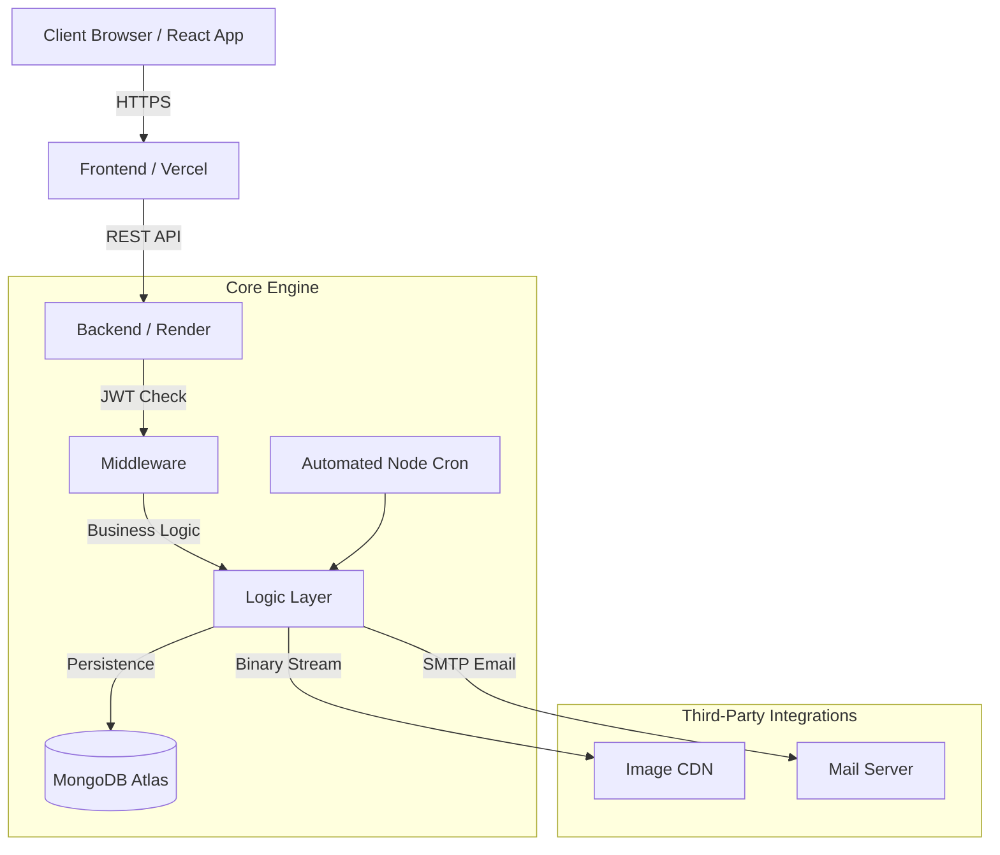

<div align="center">

# MealOra - Enterprise Home Meals Delivery Platform (MERN)

[](https://react.dev/)
[](https://nodejs.org/)
[](https://expressjs.com/)
[](https://www.mongodb.com/)
[](https://tailwindcss.com/)
[](https://vitejs.dev/)

**MealOra** is a modern, full-stack Dabba (Tiffin) Service platform built with the MERN Stack. Designed to automate the logistics of daily meal deliveries, it features a robust Role-Based Access Control (RBAC) architecture, automated financial ledgers, cron-scheduled billing, and interactive calendar management.

</div>

---

## 1. Project Vision & Comprehensive Feature List

MealOra eliminates the manual tracking of daily food subscriptions. It provides a seamless experience where customers manage a prepaid wallet, automatically pay for meals they consume, and dynamically skip days they aren't home—while giving kitchen managers deep analytical oversight.

### Customer Features (User Dashboard)
- **Prepaid Wallet Ledger:** Users deposit funds into their MealOra wallet (simulated via Razorpay/Stripe UI). The system maintains an immutable ledger of all `CREDIT` (recharges) and `DEBIT` (meal deductions) transactions.
- **Dynamic Daily Dashboard:** The landing page calculates today's delivery state in real-time. It displays the day's menu, alerts the user if their meal is *Pending Before 1 PM*, *Skipped*, or *Delivered*, and warns them if their wallet balance is too low for tomorrow's meal.
- **Subscription Toggles:** Users can globally pause or resume their daily meal subscription with a single click.
- **Interactive "Skip Meal" Calendar:** Using `@fullcalendar/react`, users can visually select future dates where they will be out of town. The backend explicitly prevents them from being billed on these dates.
- **Strict Cutoff Enforcement:** Users cannot skip today's meal after **11:00 AM IST**. The system enforces this timezone-aware cutoff globally.
- **Profile & Address Book:** Users can maintain a list of delivery addresses (Home, Office) and set their active default address dynamically.

### Kitchen Manager Features (Admin Dashboard)
- **Visual Analytics & Reports:** Integrated with `Recharts` to provide visual business intelligence. 
  - *Revenue Growth Chart:* Tracks aggregate wallet recharges over time.
  - *Meal Popularity Chart:* Bar graphs analyzing the ratio of Served vs. Skipped meals to predict kitchen inventory requirements.
- **Dynamic Menu Editor:** Admins can author the daily menu (e.g., *Ghee Rice, Bagara Baingan*) and directly upload dish photography. Images are processed via `Multer` and hosted globally on a **Cloudinary CDN**.
- **Customer CRM Table:** A comprehensive view of all registered customers, allowing admins to monitor live wallet balances, active addresses, and total meals served.
- **Manual Billing Override:** While billing is automated, admins possess a master override switch to manually trigger the daily billing deduction pipeline if required.

### Backend Automation & Logistics
- **Automated Cron Engine:** Powered by `node-cron`, the backend runs autonomous scheduled tasks every single day.
  - At exactly 1:00 PM IST, the cron job evaluates every user. If a user has an active subscription, has NOT skipped the date, and possesses sufficient wallet balance, it deducts ₹100 from their wallet and generates a ledger receipt.
- **Transactional Email Alerts:** The exact moment a meal is successfully billed and dispatched, the backend triggers an automated SMTP (`NodeMailer`) email notifying the customer that their food has been delivered.
- **Timezone-Proof Architecture:** To prevent cloud hosting issues, all critical logistics (like the 11 AM skip cutoff and the 1 PM delivery mark) are hardcoded to evaluate against **Indian Standard Time (IST)**, regardless of where the Vercel/Render servers are located globally.
- **Stateless JWT Security:** Authentication is completely stateless. JWTs are encrypted and transmitted exclusively via `HTTP-Only` cookies, rendering the application highly resilient to XSS and session hijacking.

---

## 2. System Architecture & Data Model

### High-Level Request Flow


---

## 3. How to Use (Installation & Setup)

Follow these steps to instantiate the repository on your local machine.

### Prerequisites
- Node.js (v18+)
- MongoDB Atlas Account
- Cloudinary Account
- SMTP Email Credentials (e.g., Gmail App Passwords)

### 1. Initial Setup
```bash
git clone https://github.com/Akhila-1703/mealora-app.git
cd mealora-app
```

### 2. Configure Backend
```bash
cd backend
npm install
```
Create a `.env` file in the `backend` folder:
```env
PORT=4000
DB_URL=your_mongodb_uri
JWT_SECRET_KEY=your_secret
CLOUDINARY_CLOUD_NAME=your_name
CLOUDINARY_API_KEY=your_key
CLOUDINARY_API_SECRET=your_secret
FRONTEND_URL=http://localhost:5173
SMTP_HOST=your_smtp_host
SMTP_USER=your_email
SMTP_PASS=your_email_password
```

### 3. Configure Frontend
```bash
cd ../frontend
npm install
```
Create a `.env` file in the `frontend` folder:
```env
VITE_API_BASE_URL=http://localhost:4000
```

### 4. Running the Project
Launch two separate terminals:
- **Terminal 1:** `cd backend && npm start`
- **Terminal 2:** `cd frontend && npm run dev`

---

## 4. Technical Documentation Links

For a granular look at the Project Structure, File Lists, and Package Details, please refer to the folder-specific manuals:

- [Backend Internal Docs](./backend/README.md): Details the API logic, automated cron jobs, file tree, and server packages.
- [Frontend Internal Docs](./frontend/README.md): Details the UI tree, Zustand state logic, and client packages.

---
<div align="center">
  <i>Developed to strict architectural standards for maximum performance and UX.</i>
</div>