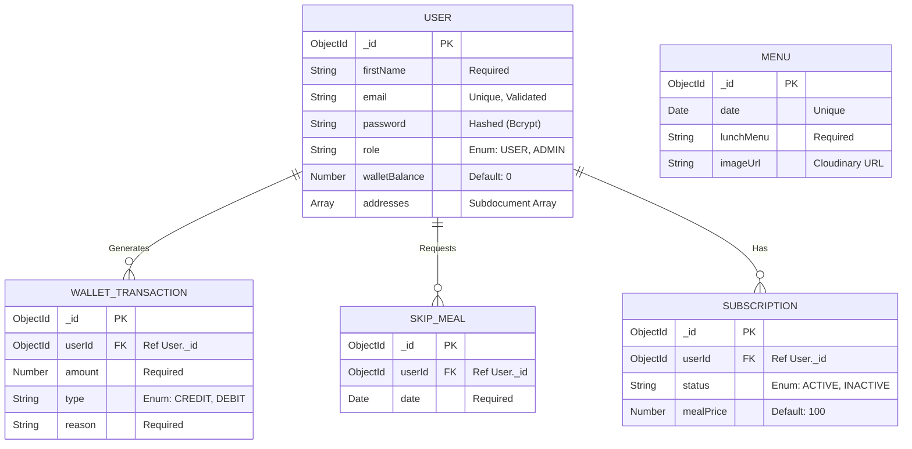

<div align="center">

# Backend Architecture & API Documentation

[](https://nodejs.org/)
[](https://expressjs.com/)
[](https://www.mongodb.com/)
[](https://mongoosejs.com/)

This document serves as the authoritative technical manual for the MealOra (Home Meals Delivered) backend. It details the internal engine: the data models, security paradigms, routing logic, and complete API contract.

</div>

---

## 1. Architecture & System Flow

This backend operates on a robust, highly modular Node.js/Express foundation designed for scalability and strict security.

- **Ingress & Security:** All incoming requests are filtered through CORS (restricted to specific frontend origins) and Cookie Parsers.
- **Stateless Auth Guard:** Protected routes are intercepted by the `verifyToken` middleware, which cryptographically validates JWTs stored in HTTP-Only cookies.
- **Controller-Service Split:** API Controllers (`*API.js`) handle HTTP lifecycles (req/res), delegating heavy business logic (like scheduled billing and emails) to Services.
- **Data Integrity Layer:** Mongoose enforces strict schema rules before data touches MongoDB.
- **Automated Cron Jobs:** Scheduled cron jobs (`node-cron`) automatically process daily meal deductions and mark meal deliveries at 1:00 PM IST.
- **Global Error Sink:** A centralized error-handling middleware catches all thrown exceptions.

---

## 2. Local Installation & Setup

To run the backend server independently:

1. **Install Dependencies**:
   ```bash
   cd backend
   npm install
   ```
2. **Environment Configuration**:
   Create a `.env` file in the backend directory. The required variables are:
   ```env
   PORT=4000
   DB_URL=your_mongodb_atlas_connection_string
   JWT_SECRET_KEY=your_super_secret_jwt_key
   CLOUDINARY_CLOUD_NAME=your_cloudinary_name
   CLOUDINARY_API_KEY=your_cloudinary_api_key
   CLOUDINARY_API_SECRET=your_cloudinary_api_secret
   FRONTEND_URL=http://localhost:5173
   STRIPE_SECRET_KEY=your_stripe_secret_key
   SMTP_HOST=your_smtp_host
   SMTP_USER=your_smtp_user
   SMTP_PASS=your_smtp_password
   ```
3. **Start the Server**:
   ```bash
   npm start
   ```

**Production Deployment Link:** [https://mealora-app.onrender.com](https://mealora-app.onrender.com)

---

## 3. Backend Project Structure (Exhaustive)
```text
backend/
├── APIs/                   # API Routes & Controllers
│   ├── AdminAPI.js         # Routes for Admin management & reports
│   ├── AuthAPI.js          # Authentication & Registration
│   ├── MenuAPI.js          # Daily menu fetching and editing
│   ├── SkipMealAPI.js      # User meal skipping logic (with 11 AM IST cutoff)
│   ├── SubscriptionAPI.js  # Subscription toggles and plans
│   ├── UserAPI.js          # User dashboard, profile, and addresses
│   └── WalletAPI.js        # Wallet balances and transaction history
├── models/                 # Mongoose Data Schemas
│   ├── UserModel.js
│   ├── WalletTransactionModel.js
│   ├── SubscriptionModel.js
│   ├── SkipMealModel.js
│   ├── MenuModel.js
│   └── BillingRunModel.js
├── middleware/             # Global request interceptors
│   └── verifyToken.js      # JWT validation logic
├── config/                 # Setup scripts
│   ├── cloudinaryConfig.js # CDN configuration
│   └── cronJobs.js         # Automated billing scripts
├── services/               # Reusable Business Logic
│   ├── emailService.js     # SMTP NodeMailer setup
│   └── mealProcessor.js    # Logic to deduct money and mark deliveries
├── .env                    # Environment configuration
├── server.js               # Server bootstrap & global error handling
└── package.json            # Manifest of dependencies and run scripts
```

---

## 4. Technology Stack & Package Evaluation

| Package | Version | Technical Purpose & Strategic Use |
| :--- | :--- | :--- |
| `express` | `^5.2.1` | Chosen for its flexible routing and middleware ecosystem. Handles the REST API layer. |
| `mongoose` | `^9.4.1` | ODM for MongoDB. Enforces type safety, validation, and schema relationships. |
| `jsonwebtoken`| `^9.0.3` | Implementation of signed tokens for secure, stateless sessions. |
| `bcryptjs` | `^3.0.3` | Cryptographic hashing of passwords to ensure data security at rest. |
| `cookie-parser`| `^1.4.7` | Critical for extracting tokens from `HTTP-Only` cookies to prevent XSS. |
| `multer` | `^2.1.1` | Efficiently handles `multipart/form-data` uploads (e.g., profile pictures and menu images) via memory-buffering. |
| `cloudinary` | `^2.9.0` | Global CDN used to host and serve optimized images. |
| `cors` | `^2.8.6` | Configured with `credentials: true` to enable secure frontend-backend session communication. |
| `dotenv` | `^17.4.1` | Ensures environment variables are securely loaded at runtime. |
| `node-cron` | `^4.2.1` | Automated task scheduling for running daily wallet deductions at 1:00 PM IST cutoff. |
| `nodemailer` | `^8.0.9` | Handles sending real-time transactional emails to users (e.g., meal delivered notifications). |
| `razorpay` | `^2.9.6` | Used as the foundational SDK to process user wallet recharges securely. |

---

## 5. Entity-Relationship (ER) Data Model



---

## 6. API Reference & Full Contract

### Auth API (`/api/auth`)
| Method | Endpoint | Auth | Purpose |
| :--- | :--- | :--- | :--- |
| `POST` | `/register` | None | Registers a standard Customer (USER). |
| `POST` | `/login` | None | Authenticates user & sets secure HTTP-only cookie. |
| `GET` | `/logout` | None | Clears the session cookie. |
| `GET` | `/verify` | ANY | Validates token and returns user payload & role. |

### User API (`/api/user`)
| Method | Endpoint | Auth | Purpose |
| :--- | :--- | :--- | :--- |
| `GET` | `/dashboard` | USER | Fetches daily delivery state, active menu, and user stats. |
| `PUT` | `/update-profile` | USER | Updates user profile and handles image uploads. |
| `POST` | `/address` | USER | Adds a new delivery address to the user's profile. |

### Wallet API (`/api/wallet`)
| Method | Endpoint | Auth | Purpose |
| :--- | :--- | :--- | :--- |
| `GET` | `/history` | USER | Fetches paginated wallet transaction history. |
| `POST` | `/recharge` | USER | Processes mock/real recharge logic and credits wallet. |

### Subscription & Skip API (`/api/subscription`, `/api/skip`)
| Method | Endpoint | Auth | Purpose |
| :--- | :--- | :--- | :--- |
| `POST` | `/toggle` | USER | Activates or deactivates daily deliveries. |
| `POST` | `/` (skip) | USER | Skips a meal for a given future date. |
| `DELETE` | `/:date` (skip) | USER | Cancels a skip request before 11:00 AM IST cutoff. |

### Admin API (`/api/admin`)
| Method | Endpoint | Auth | Purpose |
| :--- | :--- | :--- | :--- |
| `GET` | `/reports` | ADMIN | Fetches overall stats, aggregated revenue, and skips. |
| `GET` | `/users` | ADMIN | Fetches all system users with their balances. |
| `POST` | `/menus` | ADMIN | Adds or updates the daily menu and uploads images. |
| `POST` | `/process-billing` | ADMIN | Manually triggers the billing/deduction pipeline. |

---
<div align="center">
  <i>Developed to strict architectural standards for MealOra.</i>
</div>
