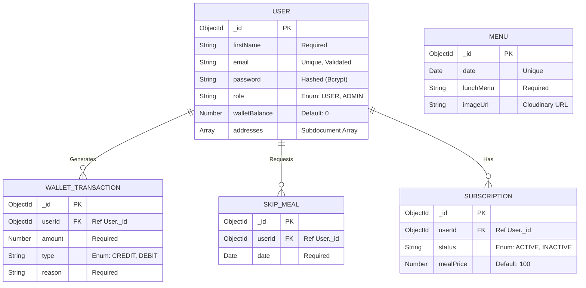

<div align="center">

# MealOra Backend API

[](https://nodejs.org/)
[](https://www.mongodb.com/)
[](https://expressjs.com/)

A robust Node.js server handling automated daily meal deductions, secure JWT authentication, and intelligent time-based delivery logic.

</div>

---

## Table of Contents

- [Tech Stack](#-tech-stack)
- [Database Architecture (ER Diagram)](#-database-architecture-er-diagram)
- [Project Structure](#-project-structure)
- [Installation & Quick Start](#-installation--quick-start)
- [Environment Variables](#-environment-variables)
- [API Reference](#-api-reference)

---

## Tech Stack

| Package | Version | Technical Purpose & Strategic Use |
|---|---|---|
| `express` | `^5.2.1` | Chosen for its flexible routing and middleware ecosystem. Handles the REST API layer. |
| `mongoose` | `^9.4.1` | ODM for MongoDB. Enforces type safety, validation, and schema relationships. |
| `jsonwebtoken` | `^9.0.3` | Implementation of signed tokens for secure, stateless sessions. |
| `bcryptjs` | `^3.0.3` | Cryptographic hashing of passwords to ensure data security at rest. |
| `cookie-parser` | `^1.4.7` | Critical for extracting tokens from HTTP-Only cookies to prevent XSS. |
| `multer` | `^2.1.1` | Efficiently handles `multipart/form-data` uploads (e.g., profile pictures and menu images) via memory-buffering. |
| `cloudinary` | `^2.9.0` | Global CDN used to host and serve optimized images. |
| `cors` | `^2.8.6` | Configured with `credentials: true` to enable secure frontend-backend session communication. |
| `dotenv` | `^17.4.1` | Ensures environment variables are securely loaded at runtime. |
| `node-cron` | `^4.2.1` | Automated task scheduling for running daily wallet deductions at 1:00 PM IST cutoff. |
| `nodemailer` | `^8.0.9` | Handles sending real-time transactional emails to users (e.g., meal delivered notifications). |
| `razorpay` | `^2.9.6` | Used as the foundational SDK to process user wallet recharges securely. |

---

## Database Architecture (ER Diagram)

The following Entity-Relationship diagram outlines the relationships driving the MealOra logic engine:



---

## Project Structure

A deeply structured Express application separating business logic, routing, and configuration.

```
backend/
├── APIs/                      # Route controllers & logic handlers
│   ├── AdminAPI.js            # Admin dashboards & menu updates
│   ├── AuthAPI.js             # Login, register, JWT issuance
│   ├── SkipMealAPI.js         # Date calculation logic for pausing meals
│   ├── SubscriptionAPI.js     # Managing user subscriptions
│   ├── UserAPI.js             # Dashboard, profile, avatar handling
│   └── WalletAPI.js           # Wallet recharge logic (Razorpay)
│
├── config/                    # 3rd-party integration setups
│   ├── cloudinary.js          # Cloudinary API keys and setup
│   ├── db.js                  # Mongoose MongoDB connection
│   └── multer.js              # Multer memory storage config
│
├── middleware/                # Route interceptors
│   ├── authMiddleware.js      # Verifies HTTP-Only JWT cookies
│   └── roleMiddleware.js      # Validates "ADMIN" vs "USER" privileges
│
├── models/                    # Mongoose database schemas
│   ├── MenuModel.js           
│   ├── SkipMealModel.js       
│   ├── SubscriptionModel.js   
│   ├── UserModel.js           
│   └── WalletModel.js         
│
├── server.js                  # Main Express entry point & middleware registration
├── package.json               # Package dependencies
└── .env                       # Secret environment variables (ignored by Git)
```

---

## Installation & Quick Start

To run the backend server locally, follow these precise steps:

1. **Navigate to the Backend directory:**
   ```bash
   cd backend
   ```

2. **Install all required packages:**
   ```bash
   npm install express mongoose jsonwebtoken bcryptjs cookie-parser multer cloudinary cors dotenv node-cron nodemailer razorpay
   ```

3. **Configure Environment Variables:**
   Create a `.env` file in the root of the `backend` folder and populate it (see section below).

4. **Start the Development Server:**
   ```bash
   npm run dev
   ```
   *The server will start on `http://localhost:4000` and establish a connection to your MongoDB instance.*

---

## Environment Variables

```env
PORT=4000
MONGO_URI=<your_mongodb_connection_string>
JWT_SECRET=<your_jwt_signing_secret>

# Cloudinary Setup for Image Uploads
CLOUDINARY_CLOUD_NAME=<your_cloud_name>
CLOUDINARY_API_KEY=<your_api_key>
CLOUDINARY_API_SECRET=<your_api_secret>

# Payment Gateway
RAZORPAY_KEY_ID=<your_razorpay_key_id>
RAZORPAY_KEY_SECRET=<your_razorpay_key_secret>

# Frontend URL for CORS
FRONTEND_URL=http://localhost:5173
```

---

## API Reference

**Base URL:** `http://localhost:4000/api`

> All protected routes require an HTTP-Only cookie containing a valid JWT.

### Auth
| Method | Endpoint | Auth | Description |
|--------|----------|------|-------------|
| `POST` | `/auth/register` | — | Register user and initialize wallet |
| `POST` | `/auth/login` | — | Authenticate and attach HTTP-Only JWT cookie |
| `POST` | `/auth/logout` | — | Clear JWT cookie session |

### User Profile
| Method | Endpoint | Auth | Description |
|--------|----------|------|-------------|
| `GET` | `/user/dashboard` | | Get aggregated dashboard stats & delivery state |
| `PUT` | `/user/update-profile` | | Update profile info (supports Multer file upload) |

### Wallet & Subscription
| Method | Endpoint | Auth | Description |
|--------|----------|------|-------------|
| `POST` | `/wallet/recharge` | | Add funds to user wallet |
| `POST` | `/subscription/create` | | Initialize daily meal subscription |
| `POST` | `/skip/meal` | | Skip a delivery date (refunds wallet, strictly enforced before 11 AM) |

### Admin (Gated)
| Method | Endpoint | Auth | Description |
|--------|----------|------|-------------|
| `GET` | `/admin/dashboard` | Admin | Fetch live revenue, active users, and aggregate KPIs |
| `POST` | `/admin/menu` | Admin | Update daily menu and upload images to Cloudinary |
| `GET` | `/admin/customers` | Admin | List all users, balances, and subscription statuses |
