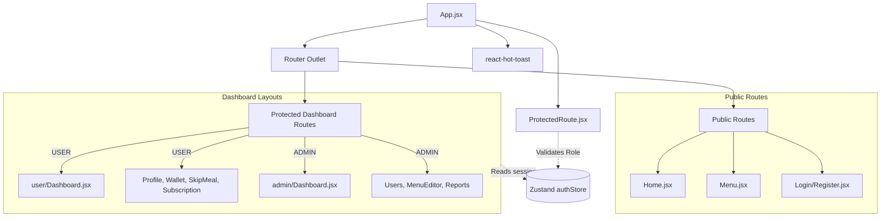

<div align="center">

# Frontend Architecture & UI Documentation

[](https://react.dev/)
[](https://vitejs.dev/)
[](https://tailwindcss.com/)
[](https://zustand-demo.pmnd.rs/)

This document details the frontend implementation for the MealOra service: a lightning-fast Single Page Application (SPA) utilizing modern React paradigms, utility-first CSS, and boilerplate-free state management.

</div>

---

## 1. Core Architecture & Routing State Machine

The frontend relies heavily on **React Router v7** for layout persistence and role-based route guarding. Global state (User Session) is hoisted into **Zustand**, allowing any component to subscribe to authentication changes without prop drilling.

### Routing & Component Topology



---

## 2. Local Installation & Setup

To run the frontend client independently:

1. **Install Dependencies**:
   ```bash
   cd frontend
   npm install
   ```
2. **Environment Configuration**:
   Create a `.env` file in the frontend directory. The required variables are:
   ```env
   VITE_API_BASE_URL=http://localhost:4000
   ```
3. **Start the Development Server**:
   ```bash
   npm run dev
   # Client will launch on http://localhost:5173
   ```

**Production Deployment Link:** [https://mealora-app.vercel.app/](https://mealora-app.vercel.app/)

---

## 3. Frontend Project Structure (Exhaustive)
```text
frontend/
├── src/
│   ├── api/            # Axios interceptors and API call wrappers
│   ├── assets/         # Static images & global CSS overrides
│   ├── components/     # UI Component Library (Modals, Buttons, Loaders)
│   ├── hooks/          # Custom React hooks (useAdmin, useUser)
│   ├── layouts/        # Global shell wrappers (Navbar, Sidebar)
│   ├── pages/          # Full-page route components
│   │   ├── Home.jsx            # Landing page
│   │   ├── Login.jsx           # Authentication
│   │   ├── Register.jsx        # Registration
│   │   ├── Menu.jsx            # Public weekly menu
│   │   ├── admin/              # Administrator protected routes
│   │   │   ├── Dashboard.jsx   # Admin metrics and stats
│   │   │   ├── MenuEditor.jsx  # Daily menu management
│   │   │   ├── Reports.jsx     # Recharts analytical graphs
│   │   │   └── Users.jsx       # Customer management table
│   │   └── user/               # Customer protected routes
│   │       ├── Dashboard.jsx   # User daily meal status
│   │       ├── Profile.jsx     # Address and profile management
│   │       ├── SkipMeal.jsx    # Calendar interface for skipping meals
│   │       ├── Subscription.jsx# Subscription toggles
│   │       └── Wallet.jsx      # Balance and recharge interface
│   ├── store/          # Global State Management
│   │   └── authStore.js        # Zustand Auth/User store
│   ├── styles/         # CSS & Style utilities
│   │   └── common.js           # Centralized Tailwind class definitions
│   ├── utils/          # Helper formatting functions (dates, currency)
│   ├── App.jsx         # React Router v7 configuration
│   └── main.jsx        # App entry point (Virtual DOM mount)
├── package.json        # Frontend dependencies & scripts
└── vite.config.js      # Vite build pipeline & Tailwind plugin mount
```

---

## 4. Technology Stack & Dependencies

| Package | Version | Technical Rationale |
| :--- | :--- | :--- |
| `react` | `^19.2.5` | Utilizes latest rendering patterns and hook-based lifecycle. |
| `vite` | `^8.0.4` | Chosen for superior HMR (Hot Module Replacement) and rapid build speed. |
| `tailwindcss` | `^4.2.2` | Next-gen utility styling for consistent, responsive UI matching the exact MealOra brand tokens (Beige, Charcoal, Terracotta). |
| `react-router` | `^7.14.1` | Industry standard for SPAs; handles protected nested layouts and role-based redirects. |
| `zustand` | `^5.0.12` | Minimal state container. Used for high-performance session hydration without Context API overhead. |
| `axios` | `^1.15.0` | Configured with `withCredentials` to handle secure HTTP-Only cookies seamlessly. |
| `react-hook-form`| `^7.72.1` | Manages complex form state with minimal re-renders. |
| `react-hot-toast`| `^2.6.0` | Elegant, non-blocking UI notifications for user actions and system alerts. |
| `@fullcalendar/react`| `^6.1.20` | Robust, interactive calendar implementation used for the "Skip Meal" functionality. |
| `recharts` | `^3.8.1` | SVG-based charting library used to render the Admin Operation reports and revenue graphs. |
| `lucide-react` | `^1.16.0` | Consistent, lightweight SVG icon system used universally across the dashboard. |
| `framer-motion` | `^12.38.0` | Powers the fluid, high-performance UI animations across the landing pages and modals. |

---

## 5. Security & State Deep Dive

### State Hydration (`checkAuth`)
Upon every refresh, the application utilizes Axios interceptors to automatically verify the presence of a secure JWT cookie against the `/api/auth/verify` endpoint. If valid, the Zustand `authStore` is instantly hydrated with the user payload, avoiding the security risks of storing sensitive JWTs in `localStorage`.

### Protected Layout Architecture
The routing leverages a gatekeeper HOC (`ProtectedRoute.jsx`). It evaluates the user's role stored in Zustand against an `allowedRoles` string (`"USER"` or `"ADMIN"`). If the active role does not match, or if the user is unauthenticated, they are redirected instantly to the login page—preventing layout flickering and securing sensitive analytical data.

---
<div align="center">
  <i>Developed for maximum performance and UX for MealOra.</i>
</div>
